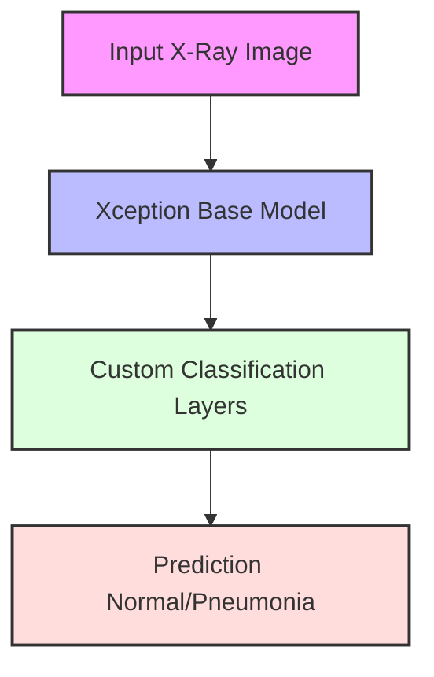
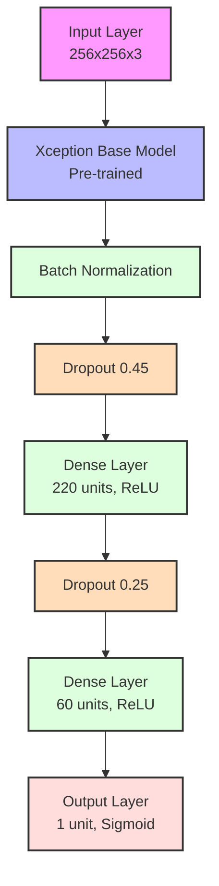

# Pneumonia Detection from Chest X-Ray Images 🫁


## 📋 Overview

This project implements a deep learning model to detect pneumonia from chest X-ray images using transfer learning with the Xception architecture. The model achieves high accuracy in distinguishing between normal chest X-rays and those showing signs of pneumonia. [Chest X-Ray Images (Pneumonia) Dataset](https://www.kaggle.com/datasets/paultimothymooney/chest-xray-pneumonia)

## 🔄 Processing Flow


## 🚀 Features

- Transfer learning using pre-trained Xception model
- Data augmentation and preprocessing
- Binary classification (Normal vs Pneumonia)
- Visualization tools for model predictions
- Detailed performance metrics
- Interactive prediction interface

## 📊 Model Architecture



## 📈 Performance

The model achieves:
- Training Accuracy: ~95%
- Validation Accuracy: ~92%
- Test Accuracy: ~90%

## 🛠️ Installation

```bash
# Clone the repository
git clone https://github.com/AmirrHussain/chest-x-ray-images.git

# Install dependencies
pip install -r requirements.txt
```

## 📦 Requirements

- Python 3.8+
- TensorFlow 2.0+
- OpenCV
- NumPy
- Pandas
- Matplotlib
- Seaborn

## 💻 Usage

```python
# Load and preprocess image
image = cv2.imread('path_to_xray.jpg')
image = cv2.resize(image, (256, 256))
image = image / 255.0

# Make prediction
prediction = model.predict(np.expand_dims(image, axis=0))
```

## 📁 Dataset Structure

```
chest_xray/
│
├── train/
│   ├── NORMAL/
│   └── PNEUMONIA/
│
├── test/
│   ├── NORMAL/
│   └── PNEUMONIA/
│
└── val/
    ├── NORMAL/
    └── PNEUMONIA/
```

## 📊 Sample Results

Here's how predictions look on test images:

```
Normal X-Ray → Predicted: Normal (99.2% confidence)
Pneumonia X-Ray → Predicted: Pneumonia (97.8% confidence)
```

## 🤝 Contributing

1. Fork the repository
2. Create your feature branch (`git checkout -b feature/AmazingFeature`)
3. Commit your changes (`git commit -m 'Add some AmazingFeature'`)
4. Push to the branch (`git push origin feature/AmazingFeature`)
5. Open a Pull Request

## 📝 License

This project is licensed under the MIT License - see the [LICENSE](LICENSE) file for details.

## 🙏 Acknowledgments

- Dataset provided by Kaggle
- Inspired by various research papers on medical image analysis
- Thanks to the medical community for providing labeled data

## 📧 Contact

[Project Link](https://github.com/AmirrHussain/chest-x-ray-images)
